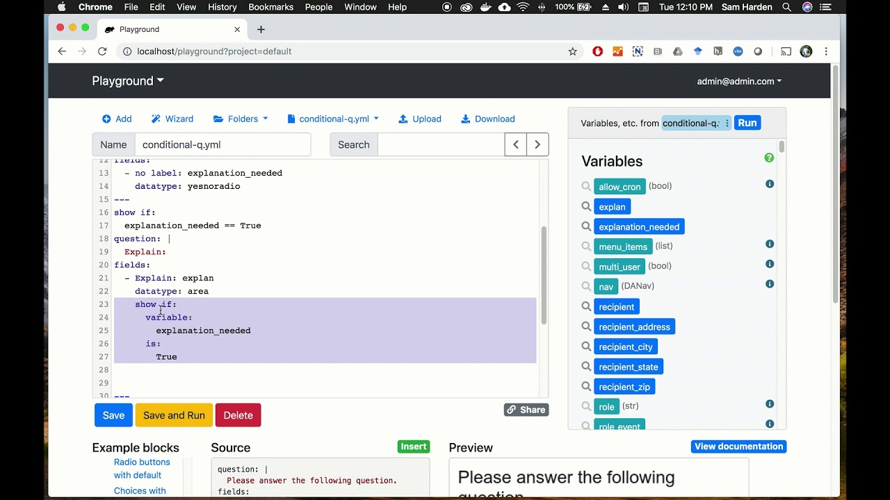

# Docassemble CI/CD pipeline

Deploy Docassemble server with CI/CD on Elestio

 
 

# Once deployed ...

You can open Docassemble UI here:

    URL: https://[CI_CD_DOMAIN]
    email: [ADMIN_EMAIL]
    password: [ADMIN_PASSWORD]
